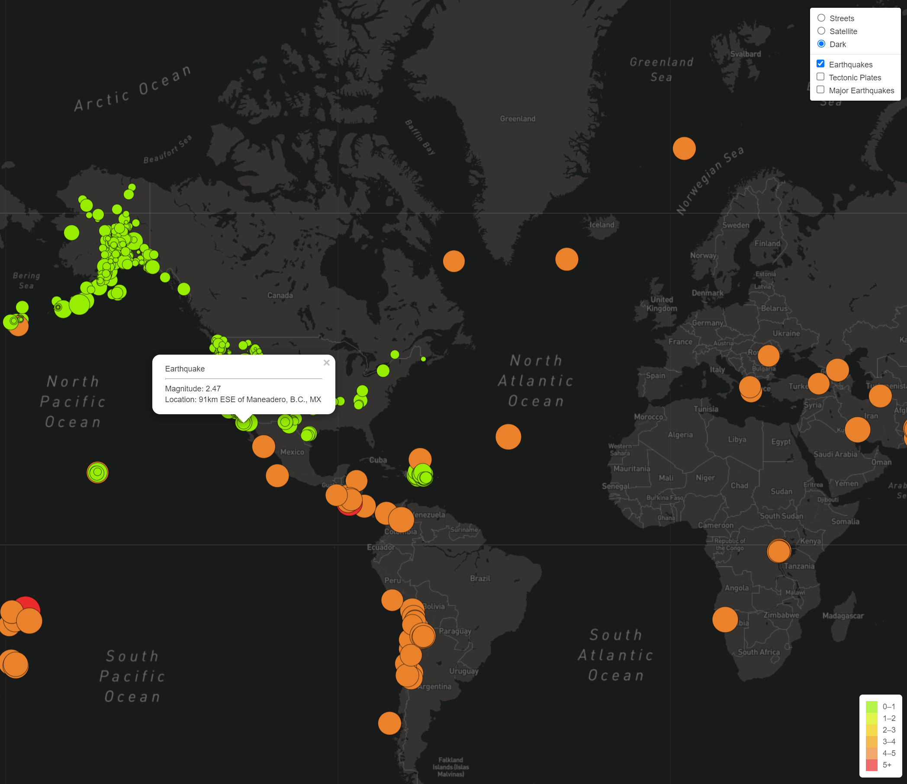
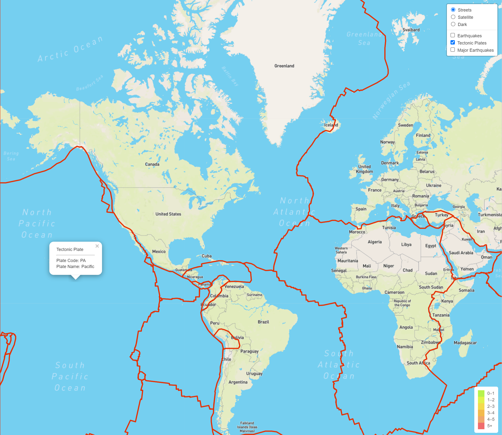

# Mapping_Earthquakes

  

The image above shows the location of earthquakes that have occurred around the world in the seven days prior to May 29, 2021.  The size and color are relative to the magnitude of the earthquake.  Anything less than a magnitude of 4 is colored a light yellow-green.  If a major earthquake location is selected, the popup will show the magnitude of the earthquake, its location and the date and time that the earthquake was recorded.

## Table of Contents
* [Overview](https://github.com/rkaysen63/Mapping_Earthquakes/blob/master/README.md#overview)
* [Resources](https://github.com/rkaysen63/Mapping_Earthquakes/blob/master/README.md#resources)
* [Files](https://github.com/rkaysen63/Mapping_Earthquakes/blob/master/README.md#files)
* [Images](https://github.com/rkaysen63/Mapping_Earthquakes/blob/master/README.md#images)
* [Notes](https://github.com/rkaysen63/Mapping_Earthquakes/blob/master/README.md#notes)

## Overview
The maps generated for this project track earthquakes around the world that have occurred within the past seven days.  The data is retrieved from the US Geological Survey's earthquakes feed.  The map opens on the streetmap layer, but the user may choose to select a satellite street map or dark layer instead.  In addition, the map opens with three overlays that include all earthdquakes that have occurred within the past seven days, the tectonic plates boundaries, and major earthquakes that have occurred within the past seven days.  Any combination of the overlays may be turned off or on.  In addition, each overlay has popups to display information about the earthquake or plate.  Note that in order to access the earthquake popups, the tectonic plates overlay may have to be toggled off temporarily in order to select an earthquake location.

## Resources

* Data:
  * Earthquake GeoJSON Data (Past 7 Days):  https://earthquake.usgs.gov/earthquakes/feed/v1.0/summary/all_week.geojson"
  * Tectonic Plate GeoJSON Data: https://raw.githubusercontent.com/fraxen/tectonicplates/master/GeoJSON/PB2002_plates.json 
  * Major Earthquake GeoJSON Data (Past 7 Days): https://earthquake.usgs.gov/earthquakes/feed/v1.0/summary/4.5_week.geojson 
* Tools: 
  * JavaScript
  * JavaScript D3 library
  * HTML
  * Leaflet
* Lesson Plan: UTA-VIRT-DATA-PT-02-2021-U-B-TTH, Module 13 Challenge
* Code:
  * https://leafletjs.com/examples/quick-start/
  * https://www.w3schools.com/colors/colors_picker.asp
  * https://gis.stackexchange.com/questions/346360/how-do-i-increase-the-font-size-of-contents-in-map-in-leaflet-js
  * https://stackoverflow.com/questions/8947240/convert-json-timestamp-to-normal-date-and-time-in-javascript

## Files
* style.css
  * This file provides additional style formatting of the map container and legend.
* index.html
  * This file creates the basic webpage.  It includes links to leaflet and css stylesheets and scripts to apply the JavaScript d3 library and to run config.js, layers.js and logic.js files.
* config.js 
  * This file has not been pushed to GitHub.  It contains the Open Street Map API key required to access Mapbox tile layers.
* layers.js
  * This file contains eight map layout variables, one for each of the eight Mapbox-owned styles (https://docs.mapbox.com/api/maps/styles/).  Three of the eight style variables are referenced in the challenge_logic.js code.
* challenge_logic.js
  * This file contains functions to retrieve the earthquake, major earthquake and tectonic plate data and functions add layers, overlays, and styling to the map.

## Images:

  

### Dark Map Layer/Earthquake Overlay
In the image above, only the "Dark" map layer and "Earthquakes" overlay are selected.  When an earthquake circle is selected, a popup will display its magnitude and location. The color and radius of the circle markers are based on the magnitude of the earthquake. The size of the circle increases with the magnitude of the earthquake. The legend shows the relationship between magnitude and color.  Please note that due to specifications in the challenge, the range of colors was later limited to three with earthquakes ranging magnitude from 0 - 4 displaying the same light green color.  

  

### Streets Map Layer/Tectonic Plates Overlay
In the image above, only the "Streets" map layer and "Tectonic Plates" overlay are selected.  When a tectonic plate is selected, a popup will display its two letter plate code and the plate's name. 

## Notes:
1. A separate layers.js was created in order to make all eight Mapbox layers readily available.
2. The GeoJSON earthquake data feature properties includes a timestamp.  The time stamp was converted to a date and time and added to the Major Earthquakes popup information.
    
       onEachFeature: function(feature, layer) {
         let d = new Date(feature.properties.time);
         let formattedDate = d.getDate() + "-" + (d.getMonth() + 1) + "-" + d.getFullYear();
         let hours = (d.getHours() < 10) ? "0" + d.getHours() : d.getHours();
         let minutes = (d.getMinutes() < 10) ? "0" + d.getMinutes() : d.getMinutes();
         let formattedTime = hours + ":" + minutes;
          
         formattedDate = formattedDate + " @ " + formattedTime;
         
         console.log(formattedDate)
         
         layer.bindPopup("Major Earthquake
Magnitude: " + 
            feature.properties.mag + " Location: " + feature.properties.place +
            " Date & Time : " + formattedDate);
       }

3. getColor() Function
   a. In the original code, the getColor() Function matches the legend in the corner with a different color for each level up to magnitude 5 with all earthquakes with a magnitude of 5 or greater than 5 lumped together.
   
       function getColor(magnitude) {
         if (magnitude > 5) {
           return "#ea2c2c";
         }
         if (magnitude > 4) {
           return "#ea822c";
         }
         if (magnitude > 3) {
           return "#ee9c00";
         }
         if (magnitude > 2) {
           return "#eecc00";
         }
         if (magnitude > 1) {
           return "#d4ee00";
         }
         return "#98ee00"; 
       }
   
   b. Later the code was changed to meet the assignment specifications that reduced the number of colors three with one color assigned to magnitudes 0 to 4, one color assigned to the magnitudes 4 to 5 and the third color assigned to magnitudes of 5 and greater.  
   
       function getColor(magnitude) {
         if (magnitude > 5) {
           return "#ea2c2c";
         }
         if (magnitude > 4) {
           return "#ea822c";
         }
         return "#98ee00";
       }

4. Because a popup showing the name of the plate selected was added to the tectonic plates layer, that layer must be temporarily toggled off in order to select an earthquake in order to retrieve its popup data.
5. Since the layers.js file contains variables for all eight Mapbox tiles, it would be very easy to add another tile layer to the challenge_logic.js.  For example, to add mapbox://styles/mapbox/navigation-night-v1, another key: value for the "Night Navigation" could be added to the baseMaps variable as follows:

       let baseMaps = {
         "Streets": streets,
         "Satellite": satelliteStreets,
         "Dark": dark,
         "Night Navigation": navigationNight  
       };

[Back to the Table of Contents](https://github.com/rkaysen63/Mapping_Earthquakes/blob/master/README.md#table-of-contents)
